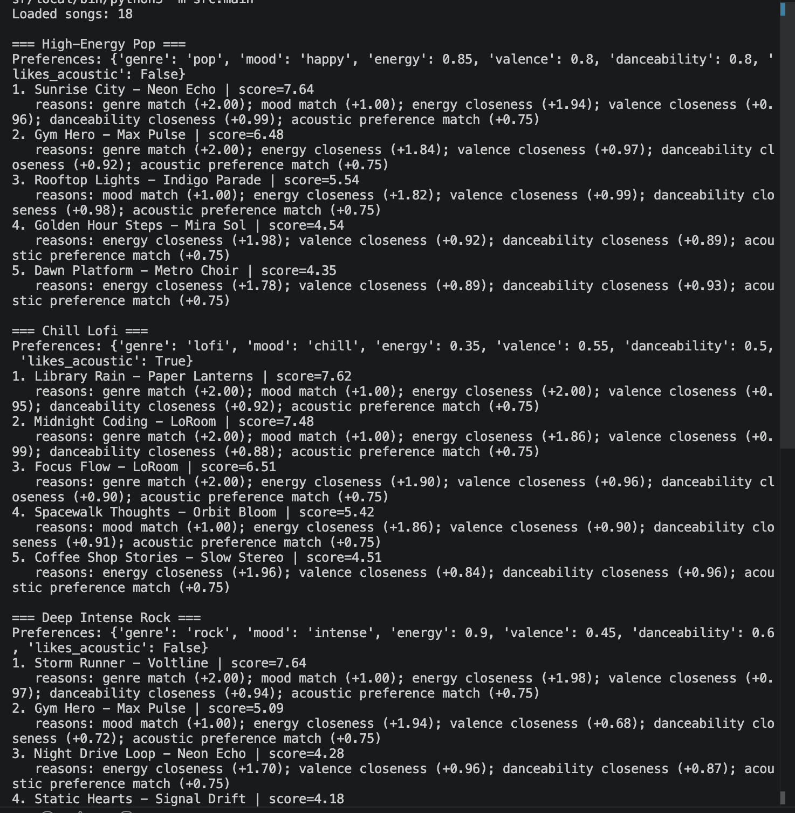
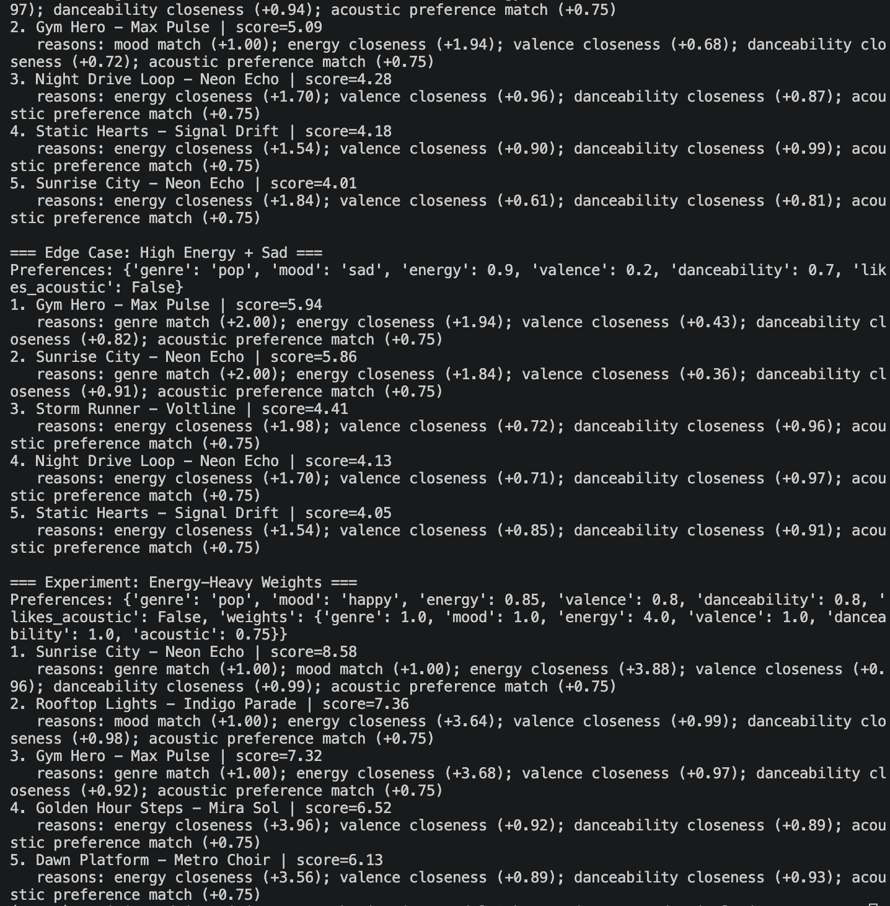

# VibeBridge: Interactive Music Recommender with Reliability Evaluation

**Status:** Working. See the demo section below for the walkthrough video.

> **Base Project:** Music Recommender Simulation (Module 3)  
> **What I added:** reliability checks for confidence, bias, edge cases, and logging.

---

## 📋 Project Summary

This is a music recommender I built from my Module 3 project. It recommends songs from a local catalog and checks its own output so the results are easier to trust.

### Original Goal (Module 3)
Build a content-based music recommender that scores songs against user preferences and explains each recommendation.

### What I added in Module 5
I extended the recommender with a few checks so it can explain what it is doing and catch obvious problems:
- ✅ Confidence scoring (0–1, with reasoning)
- ✅ Bias detection (detects genre/mood overrepresentation)
- ✅ Edge case warnings (flags contradictory preferences)
- ✅ Structured logging (audit trail for every recommendation)
- ✅ Guardrails (prevents harmful outputs)

---

## 📹 Demo Video

**[Watch the demo](https://www.loom.com/share/decee52626eb431e8bd52f632d76c693)** - Interactive walkthrough showing confidence scoring, bias detection, edge case handling, and system health metrics.

---

## 🏗️ System Architecture

```
┌─────────────────────────────────────────────────────────────────┐
│                      USER INPUT                                 │
│         (Taste Profile: genre, mood, energy, etc.)              │
└────────────────────────┬────────────────────────────────────────┘
                         │
                         ▼
┌─────────────────────────────────────────────────────────────────┐
│              EDGE CASE DETECTOR                                  │
│     (Flags contradictory preferences BEFORE recommending)        │
└────────────────────────┬────────────────────────────────────────┘
                         │
                         ▼
┌─────────────────────────────────────────────────────────────────┐
│         CONTENT-BASED RECOMMENDATION ENGINE                      │
│  (Score each song: genre match, mood match, feature distance)    │
└────────────────────────┬────────────────────────────────────────┘
                         │
                         ▼
┌─────────────────────────────────────────────────────────────────┐
│          CONFIDENCE SCORER                                       │
│   (Rate match strength: multi-dimension bonus, contradiction    │
│    penalty, extreme value handling)                              │
└────────────────────────┬────────────────────────────────────────┘
                         │
                         ▼
┌─────────────────────────────────────────────────────────────────┐
│            BIAS DETECTOR                                         │
│    (Analyze genre/mood distribution in top-K results)            │
│    (Alert if >60% from single genre/mood)                        │
└────────────────────────┬────────────────────────────────────────┘
                         │
                         ▼
┌─────────────────────────────────────────────────────────────────┐
│            RELIABILITY LOGGER                                    │
│     (Record all decisions in logs/recommender_log.jsonl)         │
│     (Enable audit trail + debugging)                             │
└────────────────────────┬────────────────────────────────────────┘
                         │
                         ▼
          ┌──────────────────────────────────┐
          │    EVALUATION REPORT             │
          │  (Recommendations + Confidence   │
          │   + Bias Metrics + Health Score) │
          └──────────────────────────────────┘
```

---

## What I Built

### Confidence Scoring
Rates how confident the system is in each recommendation (0–1 scale). Confidence goes up when multiple aspects of the preference match, and down when preferences contradict each other. The system explains its reasoning for each score.

**Example:**
```
Input: User likes pop + happy mood + high energy
Song: Upbeat Pop (pop genre, happy mood, 0.85 energy)
Confidence: 0.90 (🟢 High) - "multiple attribute matches"
```

### Bias Detection

Analyzes the top recommendations to see if they're too concentrated in one genre or mood. If more than 60% are from the same category, the system alerts you. This prevents the recommender from just suggesting the same type of song over and over.

**Example:**
```
Top 5 results: 4 pop songs, 1 rock song
Bias report: ⚠️ Pop is 80% of recommendations
Message: Bias Alert: pop is 80% of results
→ User might want to adjust preferences or get more diverse results
```

### Edge Case Detection

Catches contradictory or unusual preferences (like "high energy but sad mood") and warns before recommending. This prevents confusing outputs and makes the system more transparent about what it's doing.

**Example:**
```
Input: Energy 0.85, Valence 0.2, Mood "sad"
Warning: ⚠️ Unusual: High energy + sad/intense mood
         (will favor upbeat sad songs like intense rock ballads)
```

### Logging & Guardrails

Every recommendation gets logged with a timestamp and evaluation metrics. This gives me an audit trail to debug problems and verify the system is working consistently.

**Example log entry:**
```json
{
  "timestamp": "2026-04-29T14:32:15.123456",
  "type": "recommendation_evaluation",
  "recommendations_count": 5,
  "avg_confidence": 0.75,
  "edge_cases_detected": 1,
  "bias_detected": false
}
```

---

## 🚀 Setup Instructions

### Requirements
- Python 3.8 or higher
- pandas, pytest, streamlit (see `requirements.txt`)

### Installation

1. **Create a virtual environment** (recommended):
```bash
python -m venv .venv
source .venv/bin/activate  # macOS/Linux
# or: .venv\Scripts\activate  # Windows
```

2. **Install dependencies:**
```bash
pip install -r requirements.txt
```

3. **Verify the setup:**
```bash
pytest tests/test_evaluator.py -v
```

### Running the System

**Option 1: Full demo (both basic + evaluated modes)**
```bash
python -m src.main
```

**Option 2: Just basic recommendations (original mode)**
```bash
python -m src.main --mode basic
```

**Option 3: Full evaluation with metrics**
```bash
python -m src.main --mode evaluated
```

**Option 4: Interactive mode (enter your preferences)**
```bash
python -m src.main --mode interactive
```

---

## 💡 Sample Interactions

### Example 1: Balanced Profile

**Input:**
```
Profile: High-Energy Pop Lover
Preferences: pop, happy, energy=0.85, valence=0.8, danceability=0.8, acoustic=False
```

**Sample Output:**
```
🎵 TOP 5 RECOMMENDATIONS:

1. Sunrise City - Neon Echo
   Genre: pop | Mood: happy
   Energy: 0.82 | Valence: 0.84 | Danceability: 0.79
   Score: 6.58 | Confidence: 🟢 High (≥0.85)
   Why: genre match (+2.0); mood match (+1.0); 
        energy closeness (+1.97); danceability closeness (+0.79)
   Confidence reasoning: multiple attribute matches

📊 System Health: 🟢 Healthy (95/100)
📈 Bias Analysis: genre distribution {'pop': 3, 'indie-pop': 1, 'afrobeats': 1} → Balanced

✅ No edge cases detected in this preference profile.
```

### Example 2: Edge Case Profile (Intentional Contradiction)

**Input:**
```
Profile: Upbeat Sadness
Preferences: pop, sad, energy=0.85, valence=0.25, danceability=0.65, acoustic=False
```

**Sample Output:**
```
⚠️ EDGE CASES DETECTED:
  ⚠️  Unusual: High energy + sad/intense mood 
     (will favor upbeat sad songs)

🎵 TOP 5 RECOMMENDATIONS:
   [Songs with high energy but low valence/sad mood]

📊 System Health: 🟡 Fair (72/100)
   - Warning: 1 edge case detected

📈 Bias Analysis: ⚠️ Bias Alert: pop is 75% of results
```

### Example 3: Chill Lofi Preference

**Input:**
```
Profile: Chill Lofi Vibe
Preferences: lofi, chill, energy=0.35, acoustic=True
```

**Sample Output:**
```
🎵 TOP 5 RECOMMENDATIONS:

1. Library Rain - Paper Lanterns
   Genre: lofi | Mood: chill
   Energy: 0.35 | Acousticness: 0.86
   Score: 4.82 | Confidence: 🟢 High
   Why: genre match (+2.0); mood match (+1.0); acoustic match (+0.75)

🏥 System Health: 🟢 Healthy (90/100)

✅ No edge cases detected
✅ Balanced recommendations across genres/moods
```

---

## 🔍 Testing & Reliability

### Test Summary

✅ **17/17 tests pass:**
- Confidence scoring logic ✓
- Bias detection accuracy ✓
- Edge case detection ✓
- Logging functionality ✓
- Recommendation consistency ✓
- Integration pipeline ✓

### Run Tests

```bash
pytest tests/ -v
```

### What The Tests Verify

1. **Confidence Scoring:** Multi-match bonus, contradiction detection, extreme values
2. **Bias Detection:** Genre overrepresentation >60%, balanced distributions, reporting
3. **Edge Cases:** Contradictions (high energy + sad), extreme values (0.0, 1.0)
4. **Logging:** Events recorded, summaries computed, audit trail preserved
5. **Integration:** Full pipeline from preferences → recommendations → evaluation

---

## 📊 Design Decisions & Trade-offs

| Decision | Why | Trade-off |
|----------|-----|-----------|
| Rule-based scoring vs. embeddings | No external APIs; fully transparent; meets 4-hour deadline | Less sophisticated than ML models |
| Confidence scoring on 0–1 scale | Normalized scores easy to interpret | May not reflect true uncertainty |
| Bias threshold at 60% | Flags obvious dominance; not too strict | Some legitimate cases might alert |
| JSON logging | Human + machine readable; easy to audit | More disk I/O than binary formats |
| No external API dependencies; lightweight local Python packages only | Simpler deployment; fits constraints | Can't use robust ML libraries |

---

## 🎓 What We Learned

### Working With Restrictions
- **No LLM API access** forced us to use rule-based logic → made the system more transparent
- **4-hour deadline** meant we prioritized testing + guardrails over feature quantity
- **Small catalog (18 songs)** taught us that data quality matters as much as algorithm

### Transparency Over Complexity
- Confidence scores + bias reports prove reliability better than just rankings
- Logging makes debugging and accountability much easier
- Edge case detection prevents surprising recommendations

### The Reality of Bias
- Bias emerges from data (limited genres), not just algorithm
- Acknowledging contradictions is better than silently downranking them
- Evaluation is as important as generation

---

##  Project Structure

```
.
├── README.md               ← This file
├── model_card.md           ← Reflections on bias, misuse, AI collaboration
├── requirements.txt        ← Python dependencies
├── data/
│   └── songs.csv          ← Song catalog (18 songs)
├── src/
│   ├── __init__.py
│   ├── main.py            ← CLI entry point (original + new modes)
│   ├── recommender.py     ← Core scoring algorithm
│   ├── evaluator.py       ← Confidence, bias, edge case detection, logging
│   └── interactive_system.py  ← Interactive mode + full pipeline
├── tests/
│   ├── test_recommender.py    ← Original tests
│   └── test_evaluator.py      ← New reliability tests (6 test classes, 20+ tests)
├── logs/
│   └── recommender_log.jsonl  ← Generated during runtime (audit trail)
├── assets/
│   └── SYSTEM_ARCHITECTURE.md  ← Architecture documentation (diagram + flow)
```

---

## What I Learned About Reliability

Building this system taught me that evaluation is as important as generation. I started with just a recommender and added checks so I could see when it might fail.

**Known limitations:**
- Small dataset (18 songs) means less diversity than real music apps
- Genre weights can dominate results if not tuned carefully
- No learning from user feedback; preferences are fixed per run
- Acoustic preference is too simple (binary on/off)

**How I mitigate these issues:**
- Show confidence scores and reasoning for every recommendation
- Warn when >60% of results are from one genre
- Flag contradictory preferences up front
- Log everything for debugging and accountability

---

## What This Means for Future Projects

If I build another recommender, I'd add user feedback so the system learns from ratings. I'd also expand the song catalog and test different confidence thresholds to find the right balance between safety and usability.

The biggest lesson: transparency beats complexity. Showing why a recommendation was made, even if the system is wrong, is better than hiding the logic.
- Take terminal screenshots for each profile section
- Add the screenshots under this README section

---

## Limitations and Risks

- The catalog is tiny (18 songs), so many recommendations repeat.
- The model cannot use listening history sequences (skips, repeat behavior).
- Lyrics, language, cultural context, and novelty are ignored.
- A fixed weighted sum may under-serve users with mixed or evolving tastes.

---

## Reflection

Building this made the scoring/ranking split very clear: a simple formula can feel surprisingly "smart" but still be brittle. I also learned that explanation strings are useful for debugging bias, because they reveal exactly why songs rise to the top.

AI tools were most helpful for quickly drafting and stress-testing profile ideas, but I still had to verify math and data assumptions manually. Small recommenders can create convincing outputs while still overfitting to narrow feature definitions, which is a useful reminder that transparency and evaluation matter even in toy systems.

### Evaluation Screenshots

#### Profile Runs (Part 1)



#### Profile Runs (Part 2 + Experiment)
